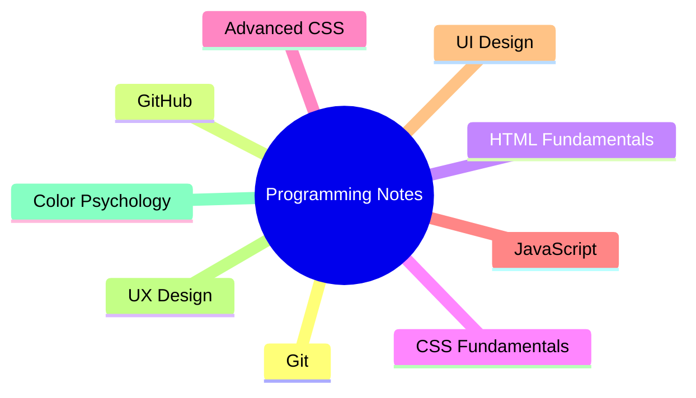

# 📚 My Programming Notes

<div align="center">

### ✍️ Handwritten Notes • 💡 Personal Knowledge Base • 🚀 Lifelong Learning


<br>


</div>

---

# 📖 About

Welcome to my personal programming notebook!

This repository is a digital archive of my handwritten programming notes, explanations, diagrams, code snippets, and learning resources.

Writing things down by hand helps me understand concepts more deeply, so instead of leaving my notebooks on a shelf, I'm preserving them here as a searchable and well-organized knowledge base.

Every page represents another step in my journey to becoming a better developer.

> **Learn → Write → Practice → Build → Repeat 🚀**

---

# 🧰 Technologies & Topics

<p align="center">


</p>

---

# 🗺️ Learning Roadmap



---

# 📚 Current Topics

| Icon                                                         | Topic             |
| ------------------------------------------------------------ | ----------------- |
|     | Git               |
|  | GitHub            |
|    | HTML Fundamentals |
|     | CSS Fundamentals  |
|     | Advanced CSS      |
|      | JavaScript        |
| 🎨                                                           | UI Design         |
| 🧠                                                           | UX Design         |
| 🌈                                                           | Color Psychology  |

---

# 📂 Repository Structure

```text
📦 Programming-Notes
│
├── 📁 Git
├── 📁 GitHub
├── 📁 HTML
├── 📁 CSS
├── 📁 Advanced-CSS
├── 📁 JavaScript
├── 📁 UI-UX
├── 📁 Color-Psychology
│
└── README.md
```

---

# 📁 Topics

<details>

<summary>📂 Git & GitHub</summary>

* 📖 Handwritten Notes
* 📷 Notebook Pages
* 💡 Tips & Tricks
* 🧠 Concepts
* 💻 Examples

</details>

<details>

<summary>🌐 HTML Fundamentals</summary>

* 📖 Notes
* 📷 Notebook Images
* 💻 Code Examples
* 🎯 Exercises

</details>

<details>

<summary>🎨 CSS Fundamentals</summary>

* Selectors
* Colors
* Box Model
* Flexbox
* Grid
* Responsive Design

</details>

<details>

<summary>✨ Advanced CSS</summary>

* Animations
* Transitions
* Transform
* Positioning
* Variables

</details>

<details>

<summary>⚡ JavaScript</summary>

* Variables
* Functions
* Arrays
* Objects
* DOM
* Events

</details>

<details>

<summary>🎨 UI / UX</summary>

* Design Principles
* Layout
* Typography
* Accessibility
* User Experience

</details>

<details>

<summary>🌈 Color Psychology</summary>

* Color Theory
* Color Harmony
* Brand Colors
* Accessibility

</details>

---

# 📸 What's Inside?

* 📝 Handwritten Notes
* 📷 Notebook Photos
* 💻 Code Snippets
* 📖 Personal Explanations
* 🧠 Mind Maps
* 🎨 Diagrams
* 💡 Tips & Tricks
* 📚 References

---

# 💭 Philosophy

> **"The faintest ink is more powerful than the strongest memory."**

I believe writing by hand helps transform information into knowledge.

This repository is my way of preserving that knowledge and making it accessible anytime, anywhere.

---

<div align="center">

### 🚀 Never Stop Learning


</div>


